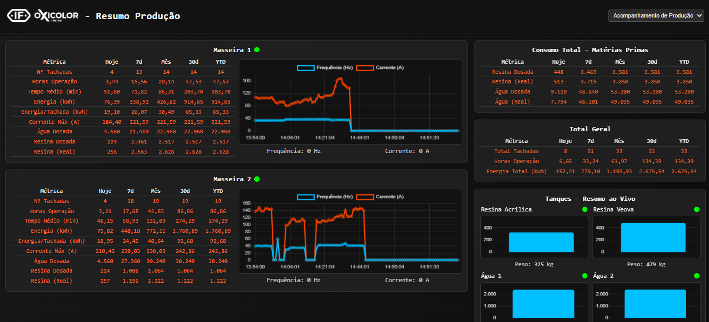

# ScadaIFOX 🌐

A Python-based **SCADA** (Supervisory Control and Data Acquisition) system designed for monitoring and controlling industrial devices, primarily using the **Modbus/TCP** protocol. The system leverages the **Flask** framework to provide a web-based interface for data visualization, logging, and operator control.



---

## 🌟 Features

* **Web Interface:** Real-time monitoring and control via a user-friendly web interface built with Flask, HTML, and CSS.
* **Modbus/TCP Communication:** Core functionality for reading and writing data (Registers and Coils) on connected industrial devices like PLCs and VFDs.
* **Configurable Devices:** Easily integrate and manage multiple devices, each with its own connection settings and data map.
* **Data Acquisition:** Polls device data at a user-defined interval.
* **Data Logging:** Persists process data using a local **SQLite database**.

---

## 🛠️ Prerequisites

* **Python 3.x**
* All required Python libraries, which can be found in the `requirements.txt` file.

---

## 🚀 Setup and Installation

1.  **Clone the repository:**
    ```bash
    git clone [https://github.com/joaopvolpi/ScadaIFOX.git](https://github.com/joaopvolpi/ScadaIFOX.git)
    cd ScadaIFOX
    ```

2.  **Install dependencies:**
    It is highly recommended to use a Python virtual environment.
    ```bash
    pip install -r requirements.txt
    ```

3.  **Configure the system:**
    Create a **`config.py`** file based on the description below and populate it with your specific device and network settings.

4.  **Run the application:**
    ```bash
    python app.py
    ```
    The web interface will be available at the address configured in your `config.py` file (e.g., `http://127.0.0.1:5000`).

---

## ⚙️ Configuration File Format (`config.py`)

The system uses a **`config.py`** file to manage all operational parameters, device connections, and Modbus register mappings.

### General Settings

| Variable | Type | Description |
| :--- | :--- | :--- |
| `POLL_INTERVAL` | `int` | Defines the frequency (in seconds) at which the Modbus devices are polled for data. |
| `FLASK_HOST` | `str` | The IP address or hostname for the Flask web server to bind to. |
| `FLASK_PORT` | `int` | The port number for the Flask web server. |
| `FLASK_DEBUG` | `bool` | Flag to enable or disable Flask's debug mode. |
| `DB_FILE` | `str` | The local path and filename for the SQLite database used for data storage. |

---

### Modbus Data Maps

These top-level dictionaries define the **mapping structure** for different types of devices or data points (e.g., one map for VFDs, another for a specific PLC model). The keys in these maps are the human-readable names used throughout the application.

#### Register Maps (Holding/Input Registers)

Dictionaries like `VFD_REGISTER_MAP` or `TANQUES_REGISTER_MAP` map a data point name to its acquisition parameters.

| Inner Key | Type | Description |
| :--- | :--- | :--- |
| **Data Point Name** (e.g., `"OutputFrequency"`) | `str` | The unique, descriptive name of the data point. |
| `address` | `int` | The starting **Modbus register address**. |
| `words` | `int` | The number of consecutive 16-bit words the value occupies (e.g., `1` for 16-bit integers, `2` for 32-bit floats/integers). |
| `unit` | `str` | The engineering unit of the data (e.g., `"Hz"`, `"A"`, `"kW"`). |
| `multiplier` | `float` | A **scaling factor** applied to the raw integer value read from the device to convert it into the engineering unit. |

#### Coil Maps (Digital Outputs/Inputs)

Dictionaries like `TANQUES_COIL_MAP` map a control point name to its parameters.

| Inner Key | Type | Description |
| :--- | :--- | :--- |
| **Control Point Name** (e.g., `"Botão Liga"`) | `str` | The unique, descriptive name of the digital control/status point. |
| `address` | `int` | The **Modbus coil address**. |
| `unit` | `str` | A string describing the data type, usually `"bool"`. |
| `description` | `str` | An optional field for external reference (e.g., the associated PLC I/O tag). |

---

### Device Definitions

The **`DEVICES`** dictionary is the central list of all physical equipment the system interacts with.

| Inner Key | Type | Description |
| :--- | :--- | :--- |
| **Device Name** (e.g., `"Masseira_1"`) | `str` | The unique identifier for the physical device. |
| `ip` | `str` | The **IP address** of the Modbus/TCP device. |
| `port` | `int` | The TCP port for Modbus communication (typically `502`). |
| `unit_id` | `int` | The **Modbus Slave ID** or Unit ID. |
| `register_map` | `str` | **The variable name of the corresponding Register Map** (e.g., `VFD_REGISTER_MAP`). |
| `coil_map` | `str` | **(Optional)** **The variable name of the corresponding Coil Map** (e.g., `TANQUES_COIL_MAP`). |

***

## 💻 Usage

Once the application is running, open a web browser and navigate to the configured Flask address. From the web interface, you will be able to:

* View real-time values from all configured device registers.
* Log and trend historical data stored in the SQLite database.
* Toggle and control the coils on equipped devices.